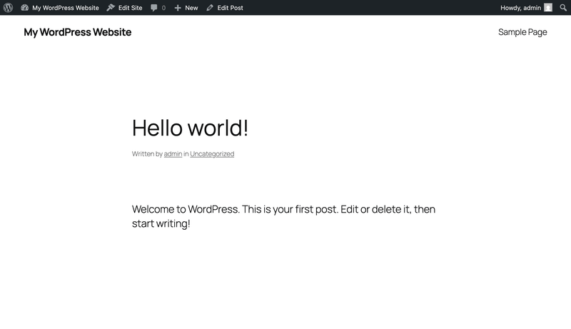

# Anybody Editing

Allow public visitors to edit WordPress posts using inline Gutenberg block editing.

## Demo

## Description

Anybody Editing transforms your WordPress posts into wiki-style editable pages. Enable public editing on specific posts, and visitors can edit content directly using the familiar Gutenberg block editor.

## Features

- Opt-in public editing per post
- Inline Gutenberg block editing on the frontend
- Edit title, content, excerpt, featured image, categories, and tags
- Custom image upload for visitors
- Full revision history for rollback
- Media library filter for visitor uploads

## Installation

1. Upload the `anybody-editing-plugin` folder to `/wp-content/plugins/`
2. Activate the plugin through the 'Plugins' screen in WordPress
3. Edit a post and check "Allow anyone to edit this post" in the sidebar
4. View the post on the frontend to see edit buttons on hover

## Usage

1. In the WordPress admin, edit a post
2. In the right sidebar, find "Public Editing" and check "Allow anyone to edit this post"
3. Save/Update the post
4. Visit the post on the frontend
5. Hover over content blocks to see the edit button
6. Click the edit button to open the inline editor
7. Make changes and click "Save"

## Requirements

- WordPress 6.0+
- PHP 7.4+
