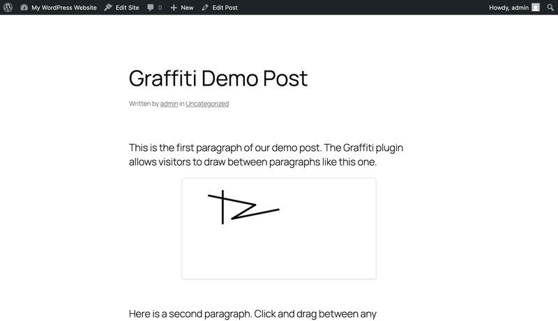

# Graffiti

Let visitors leave drawings between paragraphs of your content.

## Demo

## Description

The Graffiti plugin adds interactive drawing spaces between paragraphs on posts and pages. Visitors can click the "+" button to open a drawing canvas, select colors, and create graffiti that gets saved and displayed to all visitors.

## Features

- Drawing canvas appears between paragraphs
- Multiple color options (black, red, blue, green, yellow, white)
- Eraser tool
- Drawings are saved and visible to all visitors
- Admin settings to enable/disable the feature

## Installation

1. Upload the `graffiti-plugin` folder to `/wp-content/plugins/`
2. Activate the plugin through the 'Plugins' screen in WordPress
3. Visit any post or page to see the graffiti triggers between paragraphs

## Usage

1. Visit any post or page on the frontend
2. Click the "+" button between paragraphs
3. Select a color from the toolbar
4. Draw on the canvas
5. Click "Submit" to save your graffiti

## Requirements

- WordPress 5.0+
- PHP 7.4+
